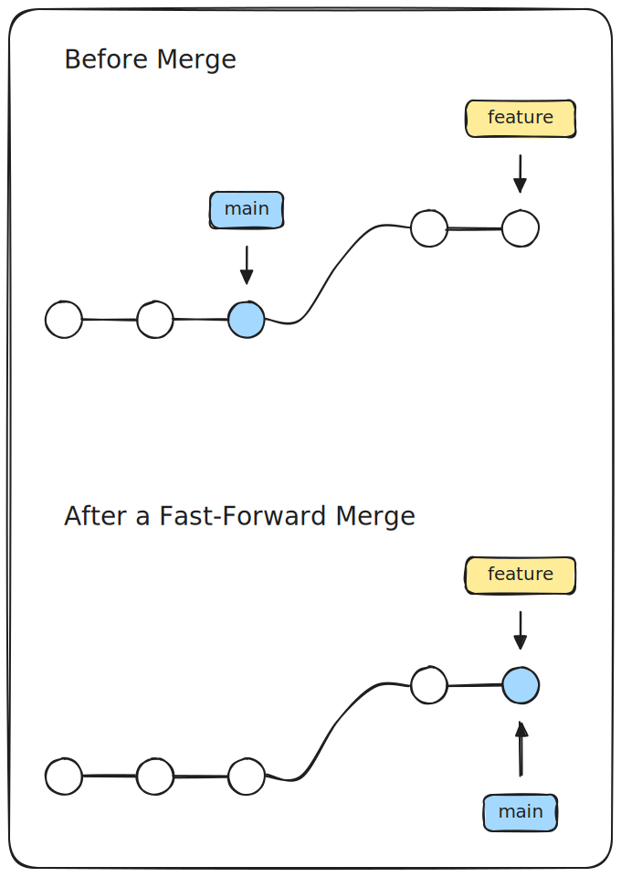
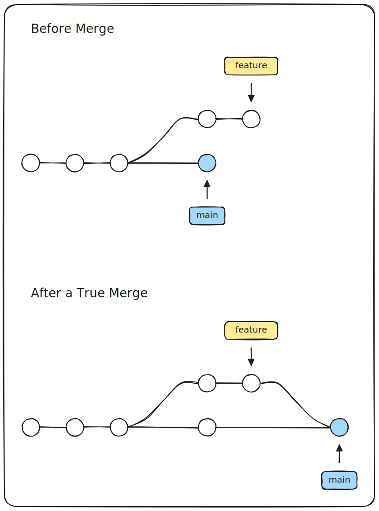
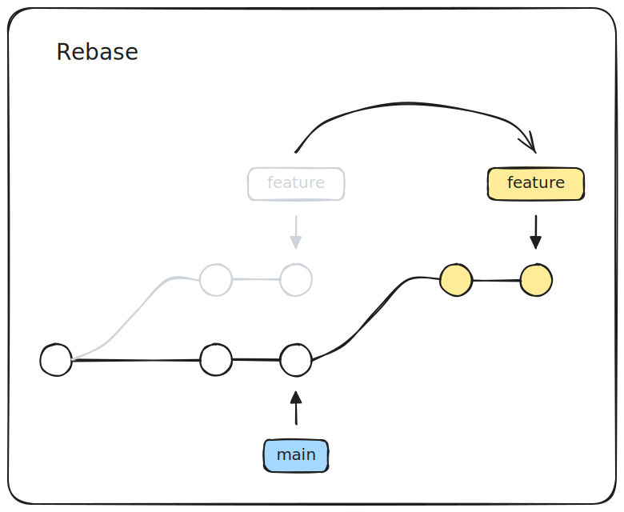
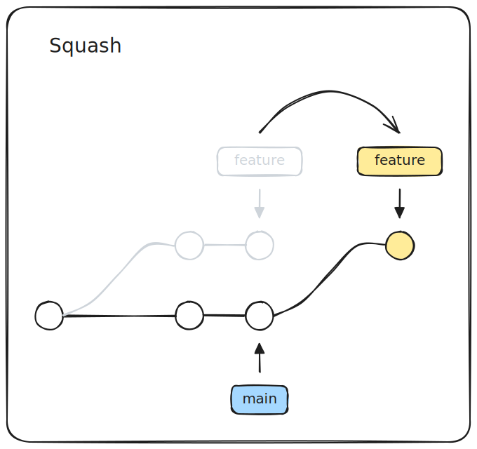
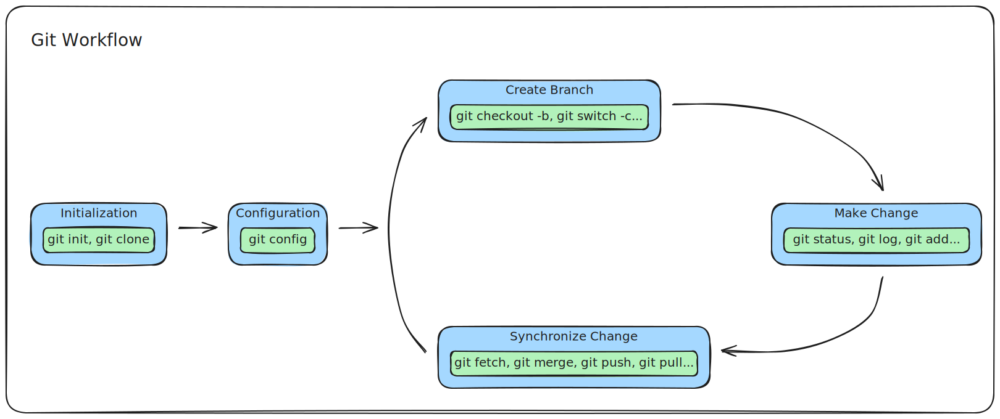

# Git Integration

## Table of Content
* [Overview](#overview)
* [Integration](#integration)
    * [Fast-Forward Merge](#fast-forward-merge)
    * [True Merge](#true-merge)
    * [Rebase](#rebase)
    * [Squash](#squash)
* [Reference](#reference)
    * [General](#general)
    * [ATLASSIAN](#atlassian)

## Overview

Merging is a fundamental operation that reconciles multiple changes made
to a version-controlled collection of files. Most often, it is necessary
when a file is modified on two independent branches and subsequently
merged. The result is a single collection of files that contains both
sets of changes.

In some cases, the merge can be performed automatically, because there
is sufficient history information to reconstruct the changes, and the
changes do not conflict. In other cases, a person must decide exactly
what the resulting files should contain. Many revision control software
tools include merge capabilities.

## Integration

### Fast-Forward Merge

A fast-forward merge can occur when there is a linear path from the
current branch tip to the target branch. Instead of "actually" merging
the branches, all Git has to do to integrate the histories is move
(i.e., "fast forward") the current branch tip up to the target branch
tip. This effectively combines the histories, since all of the commits
reachable from the target branch are now available through the current
one.

### True Merge

However, a fast-forward merge is not possible if the branches have
diverged. When there is not a linear path to the target branch, Git has
no choice but to combine them via a true merge. True merges use a
dedicated commit to tie together the two histories.

### Rebase

Rebasing is the process of moving or combining a sequence of commits to
a new base commit. Rebasing is most useful and easily visualized in the
context of a feature branching workflow.

> **Golden Rule:** Never rebase a public branch!

### Squash

Squash merging is a merge option that allows you to condense the Git
history of topic branches when you complete a pull request. Instead of
each commit on the topic branch being added to the history of the
default branch, a squash merge adds all the file changes to a single new
commit on the default branch. Squash merge commit doesn't have a
reference to the topic branch, it will produce a new commit that
contains all changes from the topic branch. Furthermore it is
recommended to delete the topic branch to prevent any confusion.

## Workflow

## Reference

### General

* [git (git-merge)](https://git-scm.com/docs/git-merge)
* [Merge Strategy and Squash Merge](https://learn.microsoft.com/en-us/azure/devops/repos/git/merging-with-squash)

### ATLASSIAN

* [Git Merge](https://www.atlassian.com/git/tutorials/using-branches/git-merge)
* [Git Rebase](https://www.atlassian.com/git/tutorials/rewriting-history/git-rebase)
