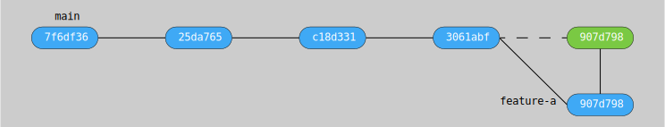

# Git Merge

## Table of Content
* [Overview](#overview)
* [Integration](#integration)
    * [Fast-Forward Merge](#fast-forward-merge)
    * [True Merge](#true-merge)
    * [Rebase](#rebase)
    * [Squash](#squash)
* [Reference](#reference)
    * [General](#general)
    * [ATLASSIAN](#atlassian)

## Overview

Merging is a fundamental operation that reconciles multiple changes made
to a version-controlled collection of files. Most often, it is necessary
when a file is modified on two independent branches and subsequently
merged. The result is a single collection of files that contains both
sets of changes.

In some cases, the merge can be performed automatically, because there
is sufficient history information to reconstruct the changes, and the
changes do not conflict. In other cases, a person must decide exactly
what the resulting files should contain. Many revision control software
tools include merge capabilities.

## Integration

### Fast-Forward Merge

### True Merge

### Rebase

### Squash

## Reference

### General

* [git (git-merge)](https://git-scm.com/docs/git-merge)

### ATLASSIAN

* [Git Merge](https://www.atlassian.com/git/tutorials/using-branches/git-merge)
* [Git Rebase](https://www.atlassian.com/git/tutorials/rewriting-history/git-rebase)
